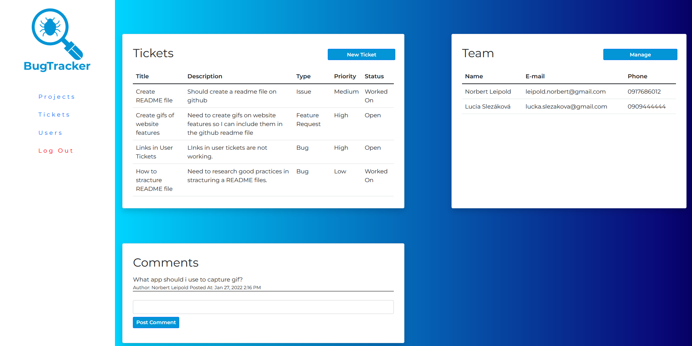

# Bug Tracker

Bug Tracker is a web application to help team of developers track their progress during project development and production cycle. You can check live version 
[here](https://bug-tracker-webapp.herokuapp.com/), even though without login credentials you can't really access. You can contact me if you are intrested in trying the application.