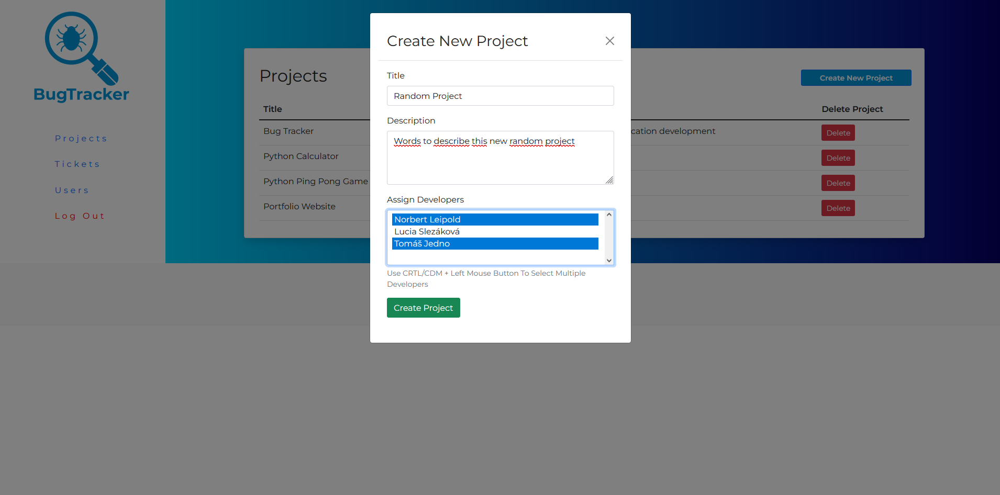

# Bug Tracker

>Bug Tracker is a web application to help team of developers track their progress during project development and production cycle. You can check live version 
[here](https://bug-tracker-webapp.herokuapp.com/).

---

## Table of contents
- [Description](#description)
- [Technologies Used](#technologies-used)
- [Usage](#usage)
- [Room for Improvement](#room-for-improvement)
- [Contact](#contact)

---

## Description

During a development of a projects, many issues and bugs can arise. It can be hard to keep track of all of them, what priority they have, even if they are being worked on, or are already solved. This web-application aims to solve this problem, by creating a easy to use enviroment, in which users can keep track of projects they are currently being assigned to, tickets the said projects have, with their status and priority, how else is working on the project and discuss their progress in comments.

---

## Technologies Used

- bootstrap
- connect-flash
- connect-mongo
- ejs
- expressjs
- helmet
- joi
- method-override
- moment
- mongoDB
- mongoose
- nodejs
- passport
- sanitize-html
- serve-favicon

---

## Usage

### Users

For a user to use the app, first, admin has to create an account for him. Password hashing and authorization is handled by a passport libary. 

There are two types of users: Developer and Admin. Developer can see only projects, he was assigned to by admin. In these projects, he can than create and manage tickets, see other developers working on this project and comment his progress or ideas for the project.

Developer can also use navigation panel on the left side of a screen to navigate between:
- Projects(lists all projects he is assigned to)

- Tickets(lists all tickets he has created)

- Users (lists all users in the database).

User with the admin privileges has all the functions of a developer type and in addition, he can: 

- create and delete projects

- in these projects, manage a team working on the project

- add, edit and delete users in the database

### Tickets
#### Priority
Tickets have 3 tiers of priority: Low, Medium, High. These can be changed anytime as needed. 

#### Type
There are also 3 types of tickets: Bug, Feature Request, Issue.

#### Status
Ticket can have 3 status types. Upon creation, it is automatically given an 'Open' status (ticket was created and is waiting to be worked on by a developer). When developer starts working on a ticket, he changes the status to 'Worked On' (ticket was picked up by a developer and is currently being handled). When developer will solve the ticket, its status can by changed to 'Closed' (there is no more work needed to be done on the ticket).

---

## Room for Improvement

- Better user creation. As of now, password of every user is manualy entered by a admin. I would like to implement more secure feature, where for example, admin creates new user without a password, new user then receive an email with a link that prompts him for password creation, after this step, his account is created.
- Even though app scales down for mobile devices, it's not the best experience and there is room for improvement. 

## Contact

Created by [Norbert Leipold](http://norbertleipold.com) - feel free to contact me